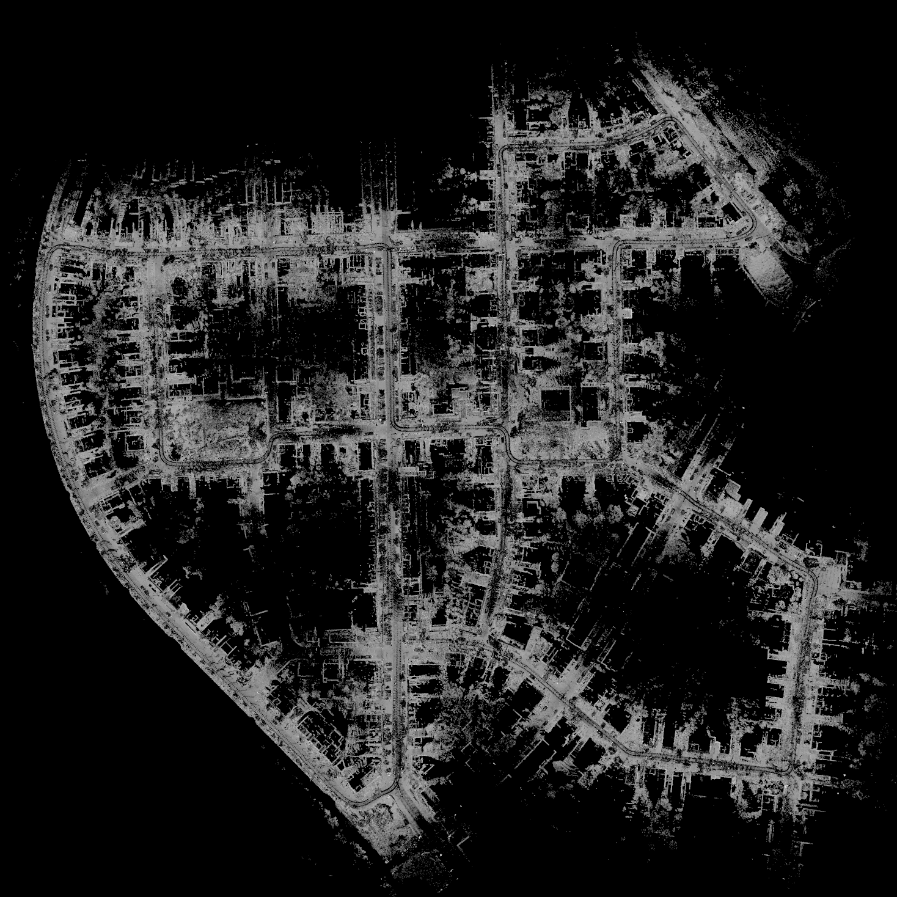
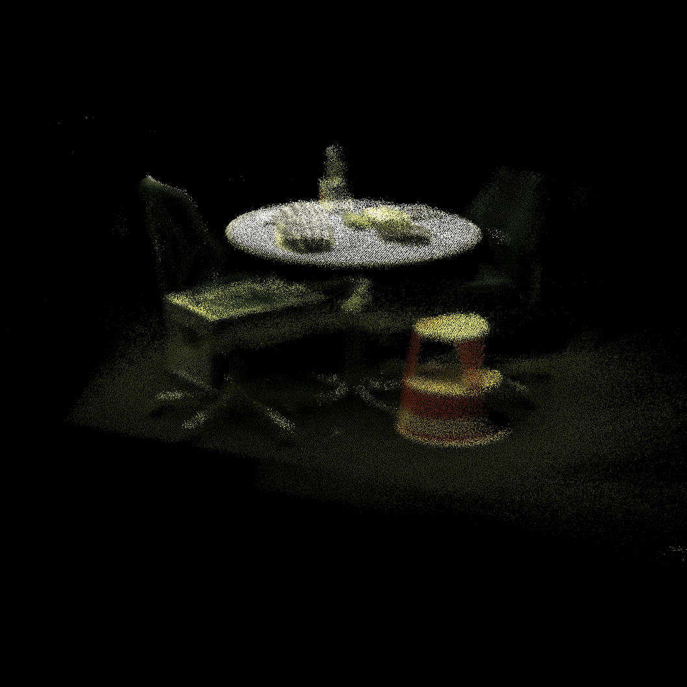

# Generalized Continuous Visual Odometry (GCVO), a Header-only GPU Implementation

<p align="center">
  
  
</p>

<p align="center">
  <a href="https://www.youtube.com/watch?v=D7dJ3j6qx7g">▶ Demo video on YouTube</a>
</p>


A correspondence-free point-cloud registration that estimates a rigid SE(3) transform between two
point clouds by **maximizing a kernelized inner product in a repoducible kernel Hilbert space (RKHS)** formulation.

Given a source and target cloud, the solver:

1. Builds a sparse kernel/correlation matrix between nearby point pairs.
2. Runs second-order iterations on SE(3) until convergence.

The kernel combines **geometry** (Euclidean or Mahalanobis distance) and
**appearance** (any per-point feature vector: intensity, RGB, FPFH, ...).

> **Transform convention:**
> `p_source = T_s2t * p_target` -- i.e. `T_s2t` maps target-frame points
> into the source frame.

## News

**2026-06-05 — KITTI benchmark (all 11 sequences, LiDAR frame-to-frame, second-order GN):**
Our refactored code improves further on the original paper's version

| Method                                     | mean t_rel (%) | mean r_rel (deg/m) |
|--------------------------------------------|---------------:|-------------------:|
| original paper                             |          1.389 |           6.89e-3  |
| **this repo, `cf_B_eigclamp.yaml`** |      **1.375** |       **4.72e-3**  |

Same evaluation protocol (KITTI cam0 frame, SVD-projected double-precision rotation error).

## Building
```bash
mkdir build && cd build
cmake .. -DCMAKE_BUILD_TYPE=Release
make -j

# Optional: enable the PCL visualiser (requires PCL visualization + VTK)
cmake .. -DGCVO_BUILD_VIZ=ON
make -j
```

Requirements: CMake, CUDA toolkit, Eigen3, yaml-cpp, PCL (common, io,
filters).  PCL visualization is only needed when `GCVO_BUILD_VIZ=ON`.

**CMake options:**

| Option | Default | Description |
|--------|---------|-------------|
| `GCVO_BUILD_APPS` | ON | Build command-line runners |
| `GCVO_BUILD_TESTS` | ON | Build unit tests |
| `GCVO_BUILD_VIZ` | OFF | Build PCL visualiser support |
| `GCVO_TEST_SAVE_PCD` | OFF | Enable `--save_pcd` flag in tests |
| `GCVO_CUDA_THREADS` | 256 | CUDA threads per block |


## Quick start demos

After building, you can run the demos below. No GPU dataset download is needed for the bunny test; the KITTI demos require the [KITTI odometry dataset](https://www.cvlibs.net/datasets/kitti/eval_odometry.php).

### 1. Stanford Bunny alignment (no external data needed)

Aligns a randomly rotated/translated copy of the bundled `demo_data/bunny.pcd` back to the original:

```bash
# From the repo root
scripts/run_bunny.sh
```

Or run directly:
```bash
./build/gcvo_test_bunny_centroid \
  --pivot origin \
  --params gcvo_params/test.yaml \
  --input_pcd_file demo_data/bunny.pcd \
  --n 2000 --theta_deg 30 --t 0.5
```

Should print `PASS`.

### 2. Inner-product GN sanity check

```bash
scripts/run_test_gn.bash
```

Or directly:
```bash
./build/gcvo_test_gn \
  --params gcvo_params/test.yaml \
  --input_pcd_file demo_data/bunny.pcd \
  --n 2000 --theta_deg 15 --t 0.0
```

### 3. KITTI frame-to-frame odometry

Runs GCVO as frame-to-frame visual odometry on KITTI LiDAR sequences.
Set `KITTI_ROOT` to wherever you downloaded the KITTI odometry dataset
(the directory containing `sequences/`).

Production setup:
- `gcvo_params/cf_B_eigclamp.yaml` — DENSE anisotropic kernel + per-point Σ eigenvalue clamping
- `--voxel_mode centroid` — closest-to-running-mean voxel downsampling
- `--first_frame_l_init 1.0` — coarser kernel for the identity-initialized first pair
- `--kitti_vert_calib_deg 0.205` — Velodyne HDL-64E vertical-angle correction

```bash
./build/gcvo_kitti_f2f \
  --params gcvo_params/cf_B_eigclamp.yaml \
  --kitti_root /path/to/kitti/dataset \
  --sequence 05 --start 0 --count 999999 \
  --voxel_mode centroid --voxel_size 0.25 \
  --first_frame_l_init 1.0 \
  --kitti_vert_calib_deg 0.205 \
  --traj_file kitti_05.kitti
```

The output trajectory file is in KITTI format (12 floats per line, 3x4 row-major).
To evaluate on the official KITTI odometry benchmark, convert lidar→cam0 frame
with `scripts/trajectory_change_basis.py` then run the C++ evaluator from
[`odometry_eval/KITTI/cpp`](https://github.com/UMich-CURLY/odometry_eval).

### 4. Pair-wise PCD alignment

Align any two PCD files:
```bash
scripts/run_align_pcd.sh ./build gcvo_params/test.yaml intensity cloud_a.pcd cloud_b.pcd
```

Or directly:
```bash
./build/gcvo_align_pcd \
  --params gcvo_params/test.yaml \
  --source cloud_a.pcd --target cloud_b.pcd \
  --type intensity            # intensity | rgb | fpfh
```

### 5. PCD sequence (frame-to-frame odometry)

Point the runner at a directory of PCD files whose filenames sort
chronologically (e.g. timestamps).  It registers consecutive pairs and
accumulates a trajectory.

```bash
./build/gcvo_run_pcd \
  --params gcvo_params/test.yaml \
  --pcd_dir /path/to/pcds/ \
  --type intensity \
  --traj_file traj.txt        # KITTI format (12 floats per line, 3x4 row-major)
```


## Running all tests

```bash
cd build && ctest --output-on-failure
```

Or run individually:
```bash
# Inner-product sanity check (single GN step, small rotation)
./build/gcvo_test_gn \
  --params gcvo_params/test.yaml \
  --input_pcd_file demo_data/bunny.pcd \
  --n 2000 --theta_deg 15 --t 0.0

# Full alignment with SE(3) error check (larger motion)
./build/gcvo_test_bunny_centroid \
  --pivot origin \
  --params gcvo_params/test.yaml \
  --input_pcd_file demo_data/bunny.pcd \
  --n 2000 --theta_deg 30 --t 0.5

# Covariance / KD-tree sanity check
./build/gcvo_test_covariance \
  --input_pcd_file demo_data/bunny.pcd \
  --n 2000
```

All should print `PASS`.

To save before/after alignment PCD files (src in red, target in blue):

```bash
cmake .. -DGCVO_TEST_SAVE_PCD=ON && make -j
./build/gcvo_test_bunny_centroid \
  --pivot origin --params gcvo_params/test.yaml \
  --input_pcd_file demo_data/bunny.pcd \
  --n 2000 --theta_deg 30 --t 0.5 --save_pcd
# Creates before_align.pcd and after_align.pcd
```


## KITTI f2f options reference

| Flag | Default | Description |
|------|---------|-------------|
| `--params` | *(required)* | Path to YAML parameter file |
| `--kitti_root` | *(required)* | KITTI odometry dataset root |
| `--sequence` | `00` | KITTI sequence number |
| `--start` | `0` | First frame index |
| `--count` | `10` | Number of frames to process |
| `--traj_file` | | Output trajectory file (KITTI 12-float format) |
| `--voxel_mode` | `pcl` | `pcl` (PCL VoxelGrid), `fast` (first-point-in-voxel), `centroid` (closest-to-running-mean, recommended), `voxel_random` (reservoir-sampled), or `none` |
| `--voxel_size` | `0.25` | Voxel cell size in meters (used by `fast`, `centroid`, `voxel_random` modes) |
| `--random_downsample` | `0` (off) | Randomly subsample to N points (applied after voxel) |
| `--max_iter` | `10000` | Override max GN iterations from YAML |
| `--first_frame_l_init` | `0.0` (off) | If `>0`, use this coarser `l_init` (with `ℓ²·I` enabled) for the first pair only — escapes the local minimum from identity initialization |
| `--cov_eig_rescale P T` | off | RKHS_BA-style eigenvalue rescaling, `plane_thresh=P`, `tangent_thresh=T` (typical KITTI: `0.1 100`) |
| `--identity_init` | off | Reset init to identity every frame (disables warm-start; diagnostic only) |
| `--kitti_vert_calib_deg` | `0.0` (off) | Per-point Velodyne HDL-64E vertical-angle correction (degrees). Set to `0.205` to match RKHS_BA's `KittiHandler` |
| `--init_row "r00,r01,...,r23"` | identity | Override the first-pair init transform (12 floats, 3×4 row-major). Lets you replay a frame with an arbitrary warm-start |
| `--visualize` | off | Live point-cloud viewer (requires `-DGCVO_BUILD_VIZ=ON`) |

For real-time computation, combine voxel + random downsampling with a tight iteration cap:
```bash
./build/gcvo_kitti_f2f \
  --params gcvo_params/gcvo_driving_nonisotropic_gn.yaml \
  --kitti_root /path/to/kitti/dataset \
  --sequence 09 --start 0 --count 10000 \
  --traj_file kitti_09.txt \
  --voxel_mode fast \
  --random_downsample 4000 \
  --max_iter 40
```

For best benchmark accuracy, use the full production config:
```bash
./build/gcvo_kitti_f2f \
  --params gcvo_params/cf_B_eigclamp.yaml \
  --kitti_root /path/to/kitti/dataset \
  --sequence 05 --start 0 --count 999999 \
  --voxel_mode centroid --voxel_size 0.25 \
  --first_frame_l_init 1.0 \
  --kitti_vert_calib_deg 0.205 \
  --traj_file kitti_05.kitti
```

For the full YAML key reference (kernel shape, length-scale schedule, eigenvalue
clamping, connection term, etc.), see the [GCvoParams reference](#gcvoparams-reference) below.


## Repository layout
```
gcvo/
  include/gcvo/           Public headers
    GCvoGPU.hpp            Solver class (declaration only -- no CUDA includes)
    GCvoParams.hpp         Runtime parameters + YAML loader
    Correlation.hpp   Sparse correlation matrix (struct + function declarations)
    impl/                 CUDA implementation headers (header-only, compiled by NVCC)
      GCvoGPU_impl.cuh                    Full solver implementation
      Correlation_impl.cuh           Sparse matrix GPU helpers
      GCvoPointCloud_covariance_impl.cuh  KNN-based covariance computation
    utils/
      GCvoPointCloud.hpp   Lightweight point-cloud container
      PointSemantic.hpp   Custom PCL point type
      PointTypes19.hpp    Pre-defined point aliases + PCL registration
      MapViewer.hpp       Optional PCL visualiser (PIMPL, compile-guarded)
  src/
    instantiations/       One .cu file per point type (explicit template instantiation)
    MapViewer.cpp         Visualiser implementation (built only with GCVO_BUILD_VIZ)
  apps/                   Command-line runners
  tests/                  Unit / integration tests
  third_party/            Vendored CUDA KD-tree from RKHS-BA
gcvo_params/               Example YAML parameter files
demo_data/                Sample PCD files (bunny.pcd)
scripts/                  Shell helpers for running demos
rkhs_ba/                  Upstream code from RKHS_BA, as a git submodule.
```


## Header-only architecture

All GCVO implementation lives in `.cuh` header files under `gcvo/include/gcvo/impl/`.
There are **no** standalone `.cu` source files for the core library logic.

Each point type (e.g. `PointS1`, `PointS3`) gets its own small `.cu` file under
`gcvo/src/instantiations/` that pulls in the impl headers and explicitly
instantiates the templates:

```cpp
// gcvo/src/instantiations/GCvoGPU_pointsem1.cu
#include "gcvo/utils/PointTypes19.hpp"
#include "gcvo/GCvoGPU.hpp"
#include "gcvo/impl/GCvoGPU_impl.cuh"
#include "gcvo/impl/GCvoPointCloud_covariance_impl.cuh"

template class gcvo::GCvoGPU<gcvo::PointS1>;
template void gcvo::GCvoPointCloudT<gcvo::PointS1>::compute_covariance(float, float, int, int, bool, bool);
```

This produces one static library per point type (`gcvo_s1`, `gcvo_s3`, etc.).
Your application code includes only the CUDA-free public headers and links
against the type(s) it needs -- no NVCC required for application code.


## Core API

### `gcvo::GCvoGPU<PointT>` (`GCvoGPU.hpp`)

The solver.  Templated on the point type; compiled via explicit instantiation
so your application code never needs CUDA headers.

```cpp
#include "gcvo/GCvoGPU.hpp"
#include "gcvo/utils/PointTypes19.hpp"

gcvo::GCvoGPU<gcvo::PointS1> solver("params.yaml");

gcvo::GCvoPointCloudT<gcvo::PointS1> src(pcl_xyzi_cloud);
gcvo::GCvoPointCloudT<gcvo::PointS1> tgt(pcl_xyzi_cloud);

// DENSE / RESCALED kernels need per-point covariance.
if (solver.params().kernel_type != gcvo::GCvoKernelType::SCALAR) {
  bool rescaled = (solver.params().kernel_type == gcvo::GCvoKernelType::RESCALED);
  src.compute_covariance(0.1f, 100.0f, 12, 8, rescaled, true);
  tgt.compute_covariance(0.1f, 100.0f, 12, 8, rescaled, true);
}

auto result = solver.align(src, tgt, Eigen::Matrix4f::Identity());
// result.T_s2t       -- estimated transform (p_src = T * p_tgt)
// result.num_iters
// result.registration_seconds
```

`align()` also has a legacy overload that writes into output references.

`cos()` computes a kernel-space overlap score between two clouds
at a given pose and length-scale, useful as a registration quality proxy.


### `gcvo::GCvoPointCloudT<PointT>` (`GCvoPointCloud.hpp`)

Lightweight container around `std::vector<PointT>`.

| Method | Description |
|--------|-------------|
| `GCvoPointCloudT(pcl_cloud)` | Construct from a PCL cloud; auto-maps `intensity` or `rgb` into `PointT::features[]` |
| `points()` | Access the underlying `std::vector<PointT>` |
| `compute_covariance(...)` | GPU KNN-based per-point covariance/normal computation (required before `align()` when using DENSE/RESCALED kernels) |
| `transform(T, in, out)` | Rigid-body transform; rotates normals and covariances when present |


### `pcl::PointSemantic<FEATURE_DIM>` (`PointSemantic.hpp`)

The custom PCL point struct used by GCVO.  A single template parameter
controls the feature vector length.

| Field | Size | Purpose |
|-------|------|---------|
| `x, y, z` | 3 | Position (via `PCL_ADD_POINT4D`) |
| `rgb` | 1 | Packed RGB (via `PCL_ADD_RGB`) |
| `features[FD]` | `FEATURE_DIM` | Per-point appearance descriptor |
| `label` | 1 | Semantic class label (integer) |
| `normal[3]` | 3 | Unit normal (filled by `compute_covariance`) |
| `covariance[9]` | 9 | 3x3 covariance matrix, row-major (filled by `compute_covariance`) |
| `cov_eigenvalues[3]` | 3 | Eigenvalues of the covariance |

The CUDA kernel reads `FEATURE_DIMENSION` at compile time to size the
feature-kernel computation.

### Pre-defined point types (`PointTypes19.hpp`)

| Alias | Feature dim | Typical use |
|-------|-------------|-------------|
| `gcvo::PointS1` | 1 | LiDAR intensity |
| `gcvo::PointS3` | 3 | RGB camera |
| `gcvo::PointS5` | 5 | RGB + image gradients |
| `gcvo::PointS33` | 33 | FPFH descriptor |


## GCvoParams reference

Parameters are loaded from a YAML file.  Every field has a compiled-in default
so you only need to specify the values you want to override.

### Kernel shape

| Key | Type | Default | Description |
|-----|------|---------|-------------|
| `kernel_type` | int | 0 | `0` = SCALAR (isotropic), `1` = DENSE (isotropic + per-point covariance in the Mahalanobis distance), `2` = RESCALED (anisotropic, per-point covariance rescales the kernel) |
| `amplitude` | float | 0.1 | Amplitude of the Gaussian kernel |
| `c_l` | float | 0.05 | Feature (appearance) bandwidth — kernel σ for color/intensity differences |
| `c_amplitude` | float | 1 | Feature-channel amplitude scale |
| `sparsity_cutoff` | float | 0.0001 | Sparsity threshold — kernel entries below this are dropped |
| `kernel_eval_max_dist` | float | inf | Hard distance² cutoff for kernel evaluation. Set to `1.0` on dense scenes to cap cost |
| `use_ell2_in_kernel` | int | 1 | Add `ℓ²·I` regularization inside `(Σ_a + Σ_b + ℓ²I)^{-1}` for DENSE/RESCALED. `0` = sharp anisotropic matching, `1` = soften (helps low-texture / sparse-overlap pairs) |
| `cov_eig_min` | float | 0.0 (off) | Clamp per-point Σ eigenvalues to this minimum. Keeps `(Σ_a + Σ_b)^{-1}` well-conditioned when KNN gives a near-degenerate Σ |
| `cov_eig_max` | float | 0.0 (off) | Clamp per-point Σ eigenvalues to this maximum |

### Length-scale schedule for isotropic kernels

For isotropic kernels, the solver starts with `l_init` and decays it toward `l_min` during
optimisation (coarse-to-fine).

| Key | Type | Default | Description |
|-----|------|---------|-------------|
| `l_init` | float | 1.0 | Initial kernel length-scale, larger values for larger motions |
| `l_min` | float | 0.05 | Minimum length-scale (stop decaying here) |
| `l_decay_rate` | float | 0.7 | Multiplicative decay factor applied each time the indicator triggers |
| `l_decay_start` | int | 30 | Number of iterations before the first decay can happen |

### Convergence

| Key | Type | Default | Description |
|-----|------|---------|-------------|
| `max_iterations` | int | 1000 | Maximum optimisation iterations |
| `tol` | float | 5e-5 | Primary convergence threshold on the step norm |
| `tol_2` | float | 1.2e-5 | Secondary (tighter) convergence threshold |
| `indicator_window` | int | 15 | Window size for the l-decay stability indicator |
| `indicator_threshold` | float | 0.2 | Threshold below which inner-product change is considered stable |
| `use_ema_indicator` | int | 0 | `0` = sliding-window indicator (original), `1` = EMA-based indicator |

### Neighbour search

| Key | Type | Default | Description |
|-----|------|---------|-------------|
| `max_neighbors` | int | 64 | Max neighbours per point when building the correlation matrix |
| `neighbor_decay` | int | 0 | `1` = adaptively shrink k based on max neighbours actually used per iteration, `0` = disabled |

### Feature / geometry toggles

| Key | Type | Default | Description |
|-----|------|---------|-------------|
| `use_geometry` | int | 1 | Include geometric (XYZ) kernel term |
| `use_features` | int | 0 | Include feature (appearance) kernel term |
| `use_connection_term` | int | 1 | `1` = add the SE(3) Christoffel correction (`-gamma^T`) to the GN curvature matrix, `0` = standard GN |

### Misc

| Key | Type | Default | Description |
|-----|------|---------|-------------|
| `export_correspondence` | int | 0 | Return the sparse correspondence matrix in the result |
| `verbose` | int | 0 | `1` = print per-iteration diagnostics |

### Example YAML

```yaml
l_init: 1.0
l_min: 0.05
amplitude: 0.1
sparsity_cutoff: 0.001
c_l: 0.05
c_amplitude: 1
max_iterations: 10000
tol: 0.00005
tol_2: 0.000012
max_neighbors: 32
l_decay_rate: 0.7
l_decay_start: 10
indicator_window: 30
indicator_threshold: 0.001
use_geometry: 1
use_features: 1
kernel_type: 0
kernel_eval_max_dist: 1
verbose: 1
use_ema_indicator: 1
```


## Adding a new point type

GCVO is header-only -- all solver and kernel code lives in `.cuh` headers.
Adding a new point type requires **no changes to the library itself**; you
choose how to instantiate it.

### 1. Define and register the PCL point type

Create an alias and register it so PCL I/O works.  You can add it directly
to `PointTypes19.hpp`, or create a new header that includes it:

```cpp
// gcvo/include/gcvo/utils/PointS8.hpp
#pragma once
#include "gcvo/utils/PointTypes19.hpp"

namespace gcvo {
  using PointS8 = pcl::PointSemantic<8>;   // 8-dim feature vector
}

// This macro (defined in PointTypes19.hpp) generates the
// PCL POINT_CLOUD_REGISTER_POINT_STRUCT call.
GCVO_REGISTER_POINTSEM(gcvo::PointS8, 8)
```

If you need a completely different point layout (not `PointSemantic`), your
struct must provide the fields the CUDA kernels expect:

- `x, y, z` -- position
- `features[N]` -- feature vector, with `static const unsigned int FEATURE_DIMENSION = N`
- `normal[3]`, `covariance[9]`, `cov_eigenvalues[3]` -- filled by `compute_covariance()`

### 2. Instantiate the templates

You have two options.  Both produce identical code; pick the one that fits
your build setup.

#### Option A -- Separate instantiation file (recommended for shared libraries)

Add a single `.cu` file under `src/instantiations/` and register it with
CMake.  This produces a dedicated static library that any number of `.cpp`
targets can link without needing NVCC themselves:

```cpp
// gcvo/src/instantiations/GCvoGPU_ps8.cu
#include "gcvo/utils/PointS8.hpp"   // your custom header from step 1
#include "gcvo/GCvoGPU.hpp"
#include "gcvo/impl/GCvoGPU_impl.cuh"
#include "gcvo/impl/GCvoPointCloud_covariance_impl.cuh"

template class gcvo::GCvoGPU<gcvo::PointS8>;
template void gcvo::GCvoPointCloudT<gcvo::PointS8>::compute_covariance(
    float, float, int, int, bool, bool);
```

```cmake
gcvo_add_point_type(gcvo_s8 gcvo/src/instantiations/GCvoGPU_ps8.cu)
target_link_libraries(my_app PRIVATE gcvo_s8)
```

#### Option B -- Instantiate directly in your runner (simplest)

If your application is already a `.cu` file (compiled with NVCC), you can
skip the separate instantiation entirely.  Just include the impl headers and
add the two instantiation lines at the bottom of your runner:

```cuda
// my_runner.cu  -- compiled with NVCC
#include "gcvo/utils/PointS8.hpp"
#include "gcvo/GCvoGPU.hpp"
#include "gcvo/impl/GCvoGPU_impl.cuh"
#include "gcvo/impl/GCvoPointCloud_covariance_impl.cuh"

// Explicit instantiation for your type -- this is all the "library" needs.
template class gcvo::GCvoGPU<gcvo::PointS8>;
template void gcvo::GCvoPointCloudT<gcvo::PointS8>::compute_covariance(
    float, float, int, int, bool, bool);

int main() {
  gcvo::GCvoGPU<gcvo::PointS8> solver("params.yaml");

  gcvo::GCvoPointCloudT<gcvo::PointS8> src(pcl_cloud_src);
  gcvo::GCvoPointCloudT<gcvo::PointS8> tgt(pcl_cloud_tgt);

  auto result = solver.align(src, tgt, Eigen::Matrix4f::Identity());
  std::cout << "T_s2t:\n" << result.T_s2t << "\n";
}
```

```cmake
# Link only the header-only interface -- no pre-compiled gcvo_sN library needed.
add_executable(my_runner my_runner.cu)
target_link_libraries(my_runner PRIVATE gcvo_headers)
```

This works because **all GCVO code is in headers**; the pre-built static
libraries (`gcvo_s1`, `gcvo_s3`, ...) are just a convenience so that
downstream `.cpp` files never need NVCC.


## Writing CUDA-free applications

The public headers (`GCvoGPU.hpp`, `GCvoPointCloud.hpp`, `PointTypes19.hpp`)
contain no CUDA device code.  All kernels live in `.cuh` headers and are
compiled once per point type in the instantiation `.cu` files.

```cpp
// my_app.cpp  (plain C++17, no CUDA)
#include "gcvo/GCvoGPU.hpp"
#include "gcvo/utils/PointTypes19.hpp"

int main() {
  gcvo::GCvoGPU<gcvo::PointS1> solver("params.yaml");
  // load clouds, call solver.align(...)
}
```

```cmake
add_executable(my_app my_app.cpp)
target_link_libraries(my_app PRIVATE gcvo_s1)   # link only the type you need
# Or link all types:
# target_link_libraries(my_app PRIVATE gcvo)
```


## Visualiser (`MapViewer`)

An optional PIMPL-wrapped PCL visualiser that incrementally displays a
point-cloud map and trajectory.  Enabled with `-DGCVO_BUILD_VIZ=ON`.

```cpp
#ifdef GCVO_USE_VIZ
#include "gcvo/utils/MapViewer.hpp"

gcvo::MapViewer viewer("My map");
viewer.add_cloud(cloud.points(), T_world);   // any container with .x .y .z
viewer.add_pose(T_world);                    // trajectory polyline
viewer.spin_once();                          // non-blocking update
// ...
viewer.spin();                               // block until window closed
#endif
```

Both `gcvo_run_pcd` and `gcvo_kitti_f2f` accept `--visualize` to use this.


## Installing and using from another project

```bash
mkdir build && cd build
cmake .. -DCMAKE_BUILD_TYPE=Release
make -j && make install
```

Downstream projects can then use `find_package`:

```cmake
find_package(gcvo REQUIRED)

# Link all precompiled point types:
target_link_libraries(my_app PRIVATE gcvo::gcvo)

# Or just one (smaller binary, faster link):
target_link_libraries(my_app PRIVATE gcvo::gcvo_s1)

# Or header-only for custom point types (you compile the instantiation yourself):
target_link_libraries(my_app PRIVATE gcvo::gcvo_headers)
```

A complete working example lives in `external_example/`.  To try it:

```bash
# 1. Install gcvo (from the gcvo repo root)
cmake -B build -DCMAKE_BUILD_TYPE=Release -DCMAKE_INSTALL_PREFIX=/tmp/gcvo_install
cmake --build build -j && cmake --install build

# 2. Build the example against the installed gcvo
cmake -B external_example/build -S external_example \
      -DCMAKE_PREFIX_PATH=/tmp/gcvo_install
cmake --build external_example/build

# 3. Run it
./external_example/build/register_clouds \
    gcvo_params/test.yaml demo_data/bunny.pcd demo_data/bunny.pcd
```

## GCVO Provenance Notice (derived from RKHS_BA, MIT license)

Portions of this repository are derived from
[RKHS_BA](https://github.com/UMich-CURLY/RKHS_BA) (MIT license).
Upstream is included in this repo as a git submodule at `rkhs_ba/`.
There is no 1:1 file mapping claimed between GCVO and RKHS_BA sources.

**This GCVO repository is NOT a verbatim copy of RKHS_BA.** It includes
substantial modifications, refactors, and additional original content
(e.g., solver/optimization changes and new utilities).

### References

- **RKHS_BA paper:** R. Zhang et al., IEEE TPAMI 2025,
  doi: [10.1109/TPAMI.2025.3593521](https://doi.org/10.1109/TPAMI.2025.3593521)
- **GCVO paper:** R. Zhang et al., CVPR 2026 (see Citations above)

### License

RKHS_BA is MIT-licensed (see `rkhs_ba/` for the upstream LICENSE).
This repo's license is in the root `LICENSE` file.

Contact (GCVO modifications): ray.zhang@tri.global

### Citations
If you find this work useful, please cite
```
@inproceedings{rayzh26,
  author    = {Ray Zhang, Marcus Greiff, Thomas Jonathan Lew, John Subosits },
  title     = {Generalized-GCVO: Fast and Correspondence-Free Point Cloud Registration with Second Order Riemannian Optimization},
  booktitle = {Proceedings of the {IEEE/CVF} Conference on Computer Vision and Pattern Recognition (CVPR)},
  year      = {2026}
}
```
